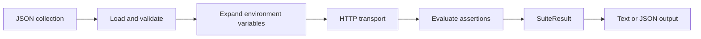

# Architecture overview

`src/api_smoke_runner/core.py` validates collection data, expands explicit
environment placeholders, performs requests through an injectable transport,
and evaluates response assertions.

`src/api_smoke_runner/cli.py` reads the collection file, selects text or JSON
output, and maps result quality to process exit codes.

## Public contract

- `ConfigError`: invalid or incomplete collection configuration.
- `RequestCase`: normalized request and expectation data.
- `ResponseData`: transport-neutral HTTP response.
- `CaseResult` and `SuiteResult`: serializable check results.
- `load_cases(payload, environ)`: validate and normalize raw JSON data.
- `run_suite(cases, transport)`: run all cases without stopping at first failure.

The transport is a callable so tests and downstream code can avoid real
network access. `tests/test_core.py` covers environment expansion, successful
assertions, assertion failures, and transport exceptions.
